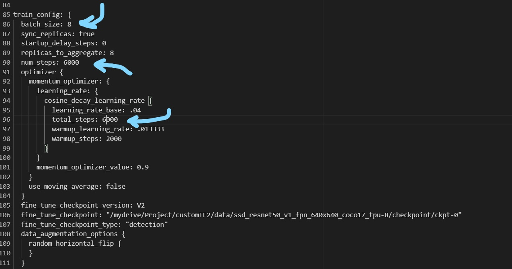
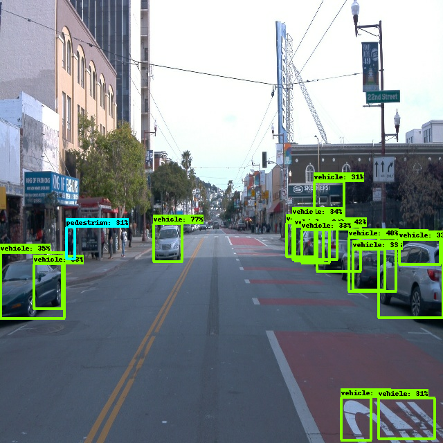
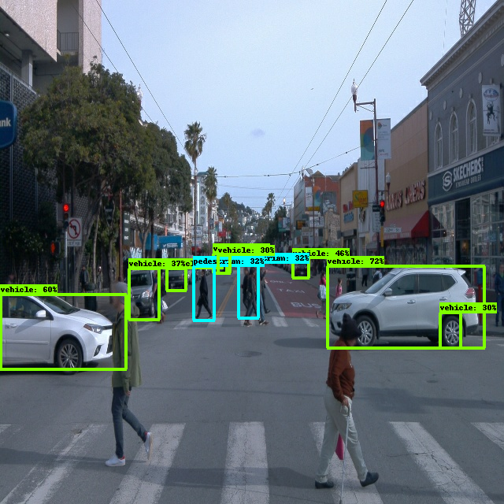
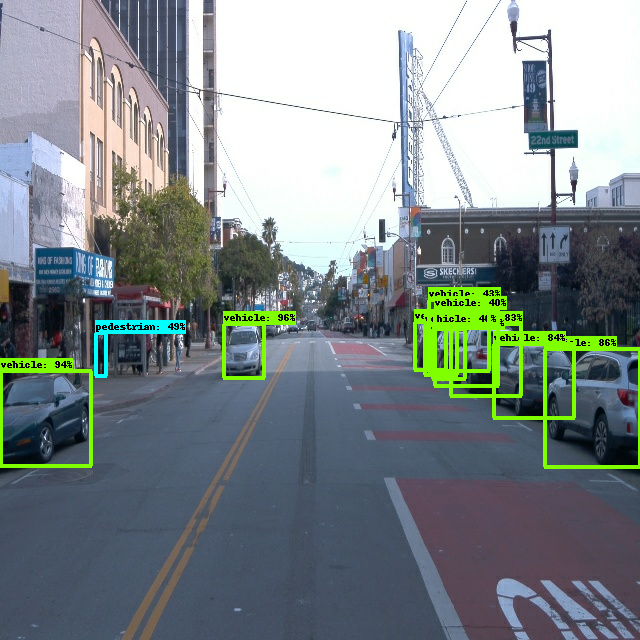
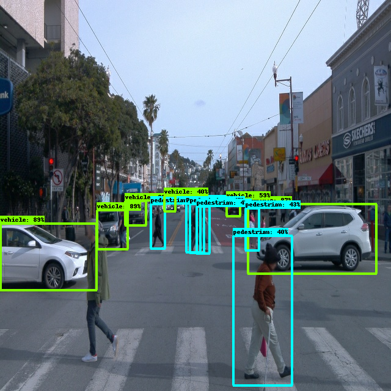
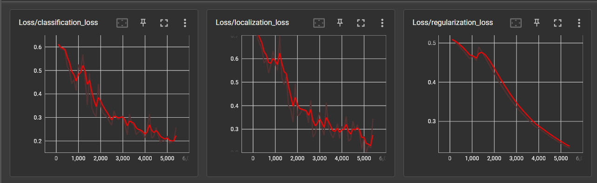

# **Object Detection in an Urban Environment 2.0**
## **Task :**
* Test at least two pretrained models (other than EfficientNet)
* Choosing the best model for deployment
## **Pre-trained models tested :**
* **EfficientNet-D1**
* **SSD MobileNet V1 FPN**
* **SSD ResNet50 V1 FPN coco17 tpu-8**

## **Running training process on Google Colab :**
**AWS** provides smoothness and speed in every process included in machine learning and deep learning through many of its services. As a result it was Udacity provided such service to its students to complete the project professionally.

Unfortunately working on **AWS** for the first time has lead to surpassing the budget limit provided. Inorder to achieve success in the tasks, shifting the training procedure to be on **Google Colab** was a necessity.

**Tensorflow Object detection API** is downloaded into **Google Colab's Virtual Machine**. A link is established between **Google Colab** and **Google Drive** where the dataset files ( **training** and **validation** ) are stored as well as a folder containing the data to be used for testing.

## **Overview of the training process :**
Going through **steps 1** to **5**, the required libraries are imported, a link is established between **Google Colab** and **Google Drive**, and te pre-trained model is intsalled.

The pre-trained model's pipeline configuration file is adjusted. Due to limitations in the resources provided the **training steps** had to be **decreased** from 300,000 steps to 6,000 and the **batch size** from 64 to 8.

**Tenserflow's TensorBoard** is started at **step 7** to monitor the training, validation, and testing process. At **step 8** the training process starts followed by the validation process. Once the step runs successfully the model is exported into the Project Folder. **Step 9** uses the frames provided for testing and the saved model to start the process of testing. The resulting detections are placed on the frames and exported together forming a video.

## **Comparing final results :**
|                        | EfficientNet                        |  SSD MobileNet | SSD ResNet50  |
|:-:                     |:-:                                  |:-:             |---            |
| Batch size             |        8                            |        8       |         8     |
| Number of training steps        |       6000                          |    6000       |     6000     |
| Detection sample result       |               |  |   |
| Video sample           |               |                                 |               |
| TensorBoard result     |               |       |               |

----------------------------------------------------------

## Loss vs steps :

By observing the result of the three models, Resnet50 was able to reach low loss values sooner than both the EfficientNet and MobileNet models. MobileNet took more steps to minimize the loss compared with EfficientNet.

1) Resnet50
2) EfficientNet
3) MobileNet

## Detection :
The models are trained to detect three classes:

* Vehicles
* Pedestrians
* Cyclists

All three models were able to detect ***vehicles*** in the provided frames for testing. Further observation showed that ***MobileNet*** was able to detect ***vehicles*** but with extra noiseness. This was not the case with ***EfficientNet*** and ***ResNet50*** models.

***Resnet50*** and ***MobileNet*** models detected ***pedestrians*** most of the time. ***MobileNet*** was having difficulties detecting ***pedestrians*** in some cases that seemed **critical**. ***EfficientNet***, on the other hand, was unable to detect pedestrians all along the testing phase.

All three models were not able to detect the ***cyclists***. This can be due to low number of steps in training and validation.

1) ResNet50
2) MobileNet
3) EfficientNet

By analyzing the results from TensorBoard after training the model, and observing the detection results on the test sample, the ResNet50 pre-trained model can be chosen as the best model among the three tested models for deployment.
